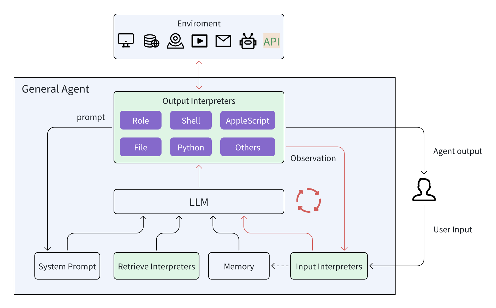

<h1 align="center">GeneralAgent: From LLM to Agent</h1>
<p align="center">
<a href="README.md"></a>
<a href="README_CN.md"></a>

</p>
<p align='center'>
A simple, general, customizable Agent framework
</p>


## Features

* Simple、Fast、Stable: stable with GPT3.5.
* GeneralAgent support serialization, include python state.
* Build-in interpreters: Python, AppleScript, Shell, File, Plan, Retrieve Embedding etc.
* Dynamic UI: Agent can create dynamic ui to user who can use.
* WebUI with agent builder. You can use natural language to create agent without coding.


## Architecture




## Demo

**Version 0.03**


**Version 0.0.2**


https://github.com/CosmosShadow/GeneralAgent/assets/13933465/9d9b4d6b-0c9c-404d-87d8-7f8e03f3772b


## Installation

**docker**

```shell
# pull docker
docker pull cosmosshadow/general-agent

# make .env
# replace the OPENAI_API_KEY key
# replace the REPLICATE_API_TOKEN key='xx' If you want to use other ai tools like ai draw、tts、...
cp .env.example .env

# run
docker run \
-p 3000:3000 \
-p 7777:7777 \
-v `pwd`/.env:/workspace/.env \
-v `pwd`/data:/workspace/data \
--name=agent \
--privileged=true \
-d cosmosshadow/general-agent

# open: localhost:3000
```


**local install**

install from pip:

```bash
pip install GeneralAgent
```

install from source code:

```shell
git clone https://github.com/CosmosShadow/GeneralAgent
cd GeneralAgent
python setup.py install
```


## Usage

### Web

```
localhost:3000
```


### Terminal

```bash
GeneralAgent
```

Optional parameters:

```shell
GeneralAgent --workspace ./test --new --auto_run
# worksapce: Set workspace directory, default ./general_agent
# new: if workspace exists, create a new workspace, like ./general_agent_2023xxx
# auto_run: if auto_run, the agent will run the code automatically, default no
```


### Python

* [examples](examples)
* [webui/server/server/applications](webui/server/server/applications)


## Join us

wechat 

<p align="center">

</p>

discord is comming soon.