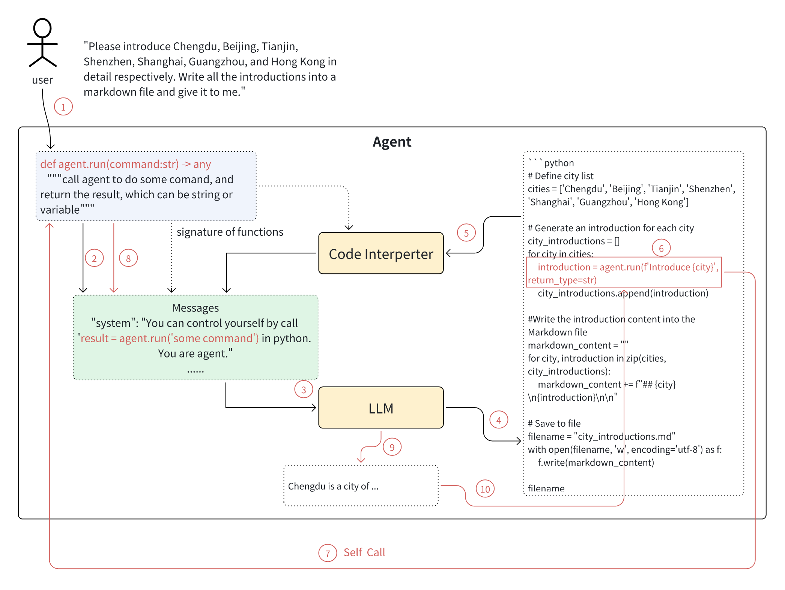
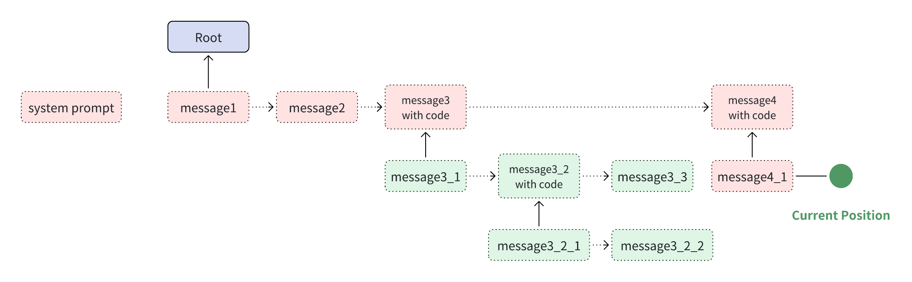
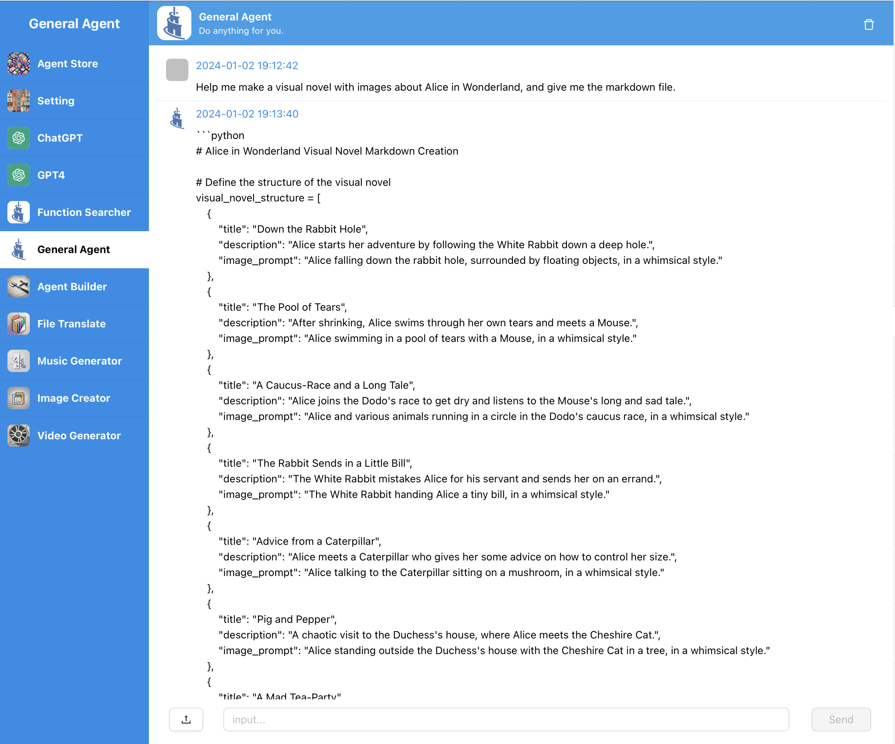

<h1 align="center">GeneralAgent: From LLM to Agent</h1>

<p align='center'>
GeneralAgent can control itself and use stack memory, to finish complex tasks automatically.
</p>

**Self-Call**



**Stack Memory**




## Features

* GeneralAgent support serialization, include python state.
* Build-in interpreters: Python, AppleScript, Shell, File, Plan, Retrieve Embedding etc.
* Agent Builder: Create agents using natural language and use them immediately, without coding.
* Self-Control & Stack Memory: GeneralAgent can control itself and has a stack memory. More detail in [paper](./docs/paper/General_Agent__Self_Call_And_Stack_Memory.pdf)
* Function Search and Use: search from thousands of functions and use them.
* [AthenaAgent](https://github.com/sigworld/AthenaAgent) is a TypeScript port of GeneralAgent.


## DEMO




## Usage

### Set Enviroment

```bash
wget https://github.com/CosmosShadow/GeneralAgent/blob/main/.env.example
cp .env.example .env
vim .env
# Then configure environment variables in the .env file.
# OPENAI_API_KEY is necessary.
# SERPER_API_KEY is necessary for google search.
```

### docker

```bash
# pull docker
docker pull cosmosshadow/general-agent

# run
docker run \
-p 3000:3000 \
-p 7777:7777 \
-v `pwd`/.env:/workspace/.env \
-v `pwd`/data:/workspace/data \
--name=agent \
--privileged=true \
-d cosmosshadow/general-agent

# open web with localhost:3000
```


### Local installation and usage

#### Installation

```bash
pip install GeneralAgent
```

#### WebUI

```bash
# export Enviroment Variable in .env
export $(grep -v '^#' .env | sed 's/^export //g' | xargs)

git clone https://github.com/CosmosShadow/GeneralAgent
cd GeneralAgent

# Web npm install
cd webui/web/ && npm install && cd ../../
cd webui/server/server/ts_builder && npm install && cd ../../../../

# Start Server
cd webui/server/server/
uvicorn app:app --host 0.0.0.0 --port 7777

# Start Web
cd webui/web
npm run start
```

#### Python usage

**Basic Use**

A Music Generation Agent

```python
from GeneralAgent.agent import Agent
from GeneralAgent import skills
role_prompt = """You are a music creator."""
functions = [skills.generate_music]
agent = Agent.with_functions(functions, role_prompt)
result = agent.run("Soft piano sound")
print(result)

# The execution of the python code is completed, and the result is as follows:
# ff4bc8c264cf.wav
# The music has been generated. You can download the audio file from the following link:
# [Download the music](./ff4bc8c264cf.wav)

```

**More Examples**

* Agent Builder: [webui/server/server/applications/agent_builder](webui/server/server/applications/agent_builder)
* File Translate (created by Agent Builder): [webui/server/server/applications/file_translate](webui/server/server/applications/file_translate)
* Image Creator (created by Agent Builder): [webui/server/server/applications/image_creator](webui/server/server/applications/image_creator)
* Music Generation Agent (created by Agent Builder): [webui/server/server/applications/music_generation_agent](webui/server/server/applications/music_generation_agent)
* General Agent: [webui/server/server/applications/general_agent](webui/server/server/applications/general_agent)
* Function Search: [webui/server/server/applications/function_search](webui/server/server/applications/function_search)

## Development

* Build, code development and release in docker environment: [docs/develop/docker.md](docs/develop/docker.md)
* pip library packaging process: [docs/develop/package.md](docs/develop/package.md)
* Unit testing and release (pip & docker) process: [docs/develop/test_publish.md](docs/develop/test_publish.md)

## License

The intended purpose and licensing of GeneralAgent is solely for research use.

The source code is licensed under Apache 2.0.


## Paper

[General Agent: Self-Call and Stack Memory](./docs/paper/General_Agent__Self_Call_And_Stack_Memory.pdf)


## Join us

Scan the QR code below with WeChat

<p align="center">

</p>